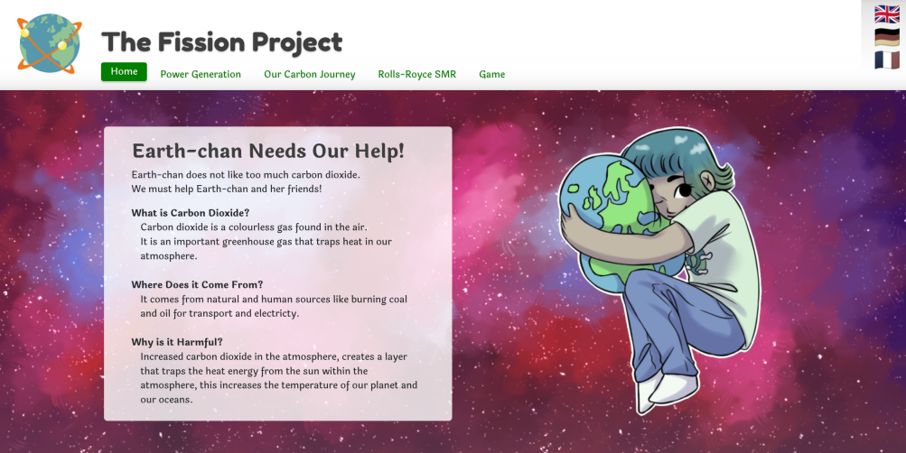

  

# The Fission Project - Rolls Royce hackathon group project.
A website aimed at primary school children that teaches them where our power comes from and introduces Rolls-Royce small modular reactors, featuring lots of information and an interactive game. We made the bulk of this project over the course of two days.

### We won joint first place.
https://bfrd.uk/Hackathon2022-FlatWebsite/
